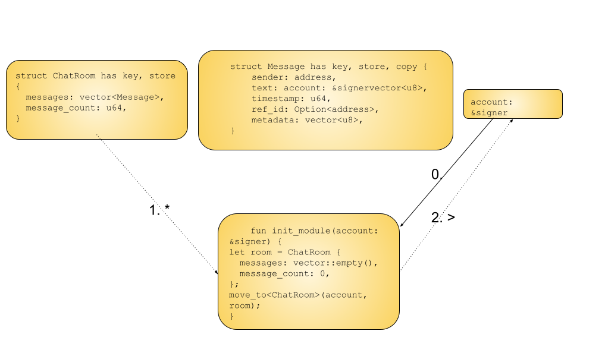

# Project Overview

This lesson contains an overview of the project you'll build throughout the course. You'll create a model of the domain and look into how Move plays into each component.

## Your dApp's user story

A user story is a narrative about your dApp, from your dApp user's perspective.

> ## Chat Room User Story Example
>
> "I went to this site called Move Chat. There were all these messages getting posted, from lots of different wallets. I connected my wallet with a button in the upper right corner. And then I typed in my first message: "Hello, Move!" I clicked Send, signed with my wallet, and my message posted, onto the blockchain! I've been using Move Chat for months now - met several great friends and business partners on there and love the new features they keep adding.
>

> ## Track Your Progress: User Story
> 
> Write a user story for the chat app you created. Include features that you haven't built yet, which you think could be good to add. 
> Copy your user story's text and <a href="">submit here for credit on Galxe.</a>
>

## Your dApp's architecture diagram
To create a diagram of Move Chat, start by looking at the types and functions specified in the module code:

```rust
    struct ChatRoom has key, store {
        messages: vector<Message>,
        message_count: u64,
    }

    struct Message has key, store, copy {
        sender: address,
        // Post's text.
        text: vector<u8>,
        // Post's timestamp.
        timestamp: u64,
        // Set if referencing an another object (i.e., due to a Like, Retweet, Reply etc).
        // We allow referencing any object type, not only Message NFTs.
        ref_id: Option<address>,
        // app-specific metadata. We do not enforce a metadata format and delegate this to app layer.
        metadata: vector<u8>,
    }

    fun init_module(account: &signer) {
        let room = ChatRoom {
            messages: vector::empty(),
            message_count: 0,
        };
        move_to<ChatRoom>(account, room);
    }

    /// Create a new chat room.
    public entry fun create_chat_room(account: &signer) {
        let addr = signer::address_of(account);
        assert!(!exists<ChatRoom>(addr), E_CHAT_ROOM_EXISTS);
        let room = ChatRoom {
            messages: vector::empty(),
            message_count: 0,
        };
        move_to(account, room);
    }

    /// Simple Message object getter.
    #[view]
    public fun get_messages(addr: address) : vector<Message> acquires ChatRoom {
        let room = borrow_global<ChatRoom>(addr);
        room.messages
    }
```

`init_module` is a function that gets called once, when the module is first deployed. 

`init_module` takes in a reference to a `signer` then creates a new `ChatRoom` object and moves it to the signer's account address.

Here's one way to represent that with a diagram:



In the above diagram, an asterisk (*) represents creating a new instance of some type. 

The angle bracket (>) represents moving a resource to an account.

* **Step 0:** The wallet (`account`) calls the `init_module` function 
* **Step 1:** `init_module` creates a new `ChatRoom` resource
* **Step 2:** The `ChatRoom` resource is moved to `account`.

> ## Track Your Progress: Architectural Diagram
>
> * Create a diagram representing the `create_chat_room` function. 
> * Just create text boxes and add the code for each relevant struct and function. Then diagram the steps to represent what happens when the function is called. 
> * Take a screen shot or save the image and <a href="">upload here to get credit on Galxe.</a>
>